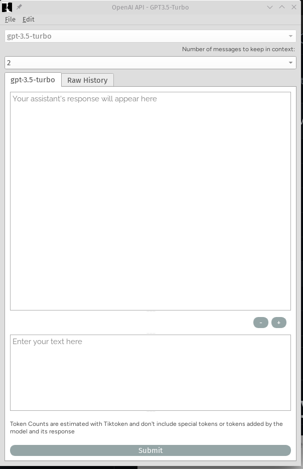

# Generally-Pretty-True-Assistant



This Python program uses the OpenAI API to create a chat window that can be customized to meet the user's needs. 

It includes features such as saving chat history, viewing raw outputs from the API, and setting an API key. The program is designed to be user-friendly and helpful, allowing users to easily interact with the OpenAI API and receive responses in real-time. Overall, this program is a useful tool for anyone looking to leverage the power of the OpenAI API for their projects.

Please note that you must enter your own OpenAI API key either through the File Menu > Set API Key, or by setting the following environment variable (and logging out then back in for your login shell to recognize it)


```shell
OPENAI_API_KEY = yourAPIkeyhere
```

At the moment, you can run this program by running the following commands:


```shell
pip install --requirement=requirements.txt && python3 main.py
```

After installing the python requirements, you can just run "python3 main.py" by itself to run this program.

<br>

## FAQ

___

### Can you use gpt 4.0 without a plus membership?

Since this program uses your own API key, you would need to make sure that your API account has access to GPT-4. This is different from your ChatGPT account, and more information can be found here:

https://openai.com/blog/openai-api


###  I checked the FAQ and it looks like it's only limited by token (and requests) per minute? 

OpenAI's API limits requests by token, however a token is about 4 letters (roughly) and are billed at a rate of 0.003 US cents per 1000 tokens as of the time of this writing.

As far as rate limiting goes, for the scope of a chat program using one API key it would likely be very difficult to reach the rate limit.

**From OpenAI:**

    What are the rate limits for our API?

    We enforce rate limits at the organization level, not user level, based on the specific endpoint used as well as the type of account you have. Rate limits are measured in two ways: RPM (requests per minute) and TPM (tokens per minute). The table below highlights the default rate limits for our API but these limits can be increased depending on your use case after filling out the Rate Limit increase request form.

For a free trial user (using the allowance that OpenAI provides), this limit is 40,000 TPM, or roughly 160,000 words per minute.

For someone who has added their card for Pay As You Go, Pay-as-you-go users (first 48 hours), this limit is increased to 60,000 TPM, and 90,000 TPM after 48 hours.

For some perspective, this is how much they've billed me so far after sending in over 300+ requests:

